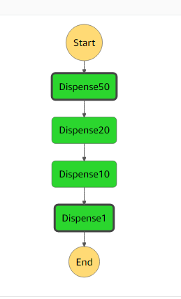

CORS ATM step function

Sets up step functions that can process an input and push to the next lambda if no work is needed.

Each lambda is set up to handle its own scenario

Each function has its backoff and retry strat

